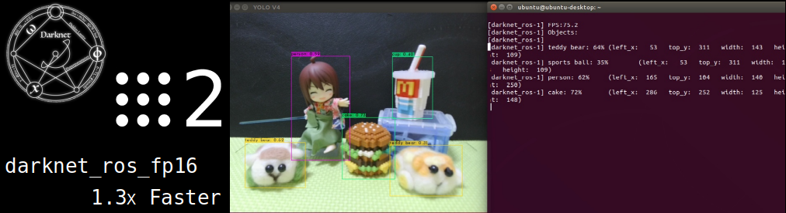
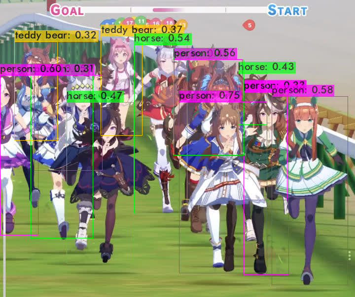

# Ar-Ray 🌟 🐢 🐧 🍓 🐋 🦈 ♾️ 🏇 🎍

- Pronunciation : Ar-Ray (えいあーる・れい , ei ar rei)

  
  ← icon for twitter & blog（2021~）
  
  ← URARA-Challenge MODE❗❗（2022）

<!--  -->

<!--  -->

<!-- Like のバッジ -->

<!-- Articles のバッジ -->

<!-- Followers のバッジ -->

<!-- Books のバッジ -->

<!-- Scraps のバッジ -->

<!--  -->

<!--  -->

<!-- 
## Repositories（リポジトリ）

バナーをクリックするとリポジトリに飛びます。

Click banners to access my GitHub repositories.

 -->
<!--  -->

**Please support me**❗ 👉 

